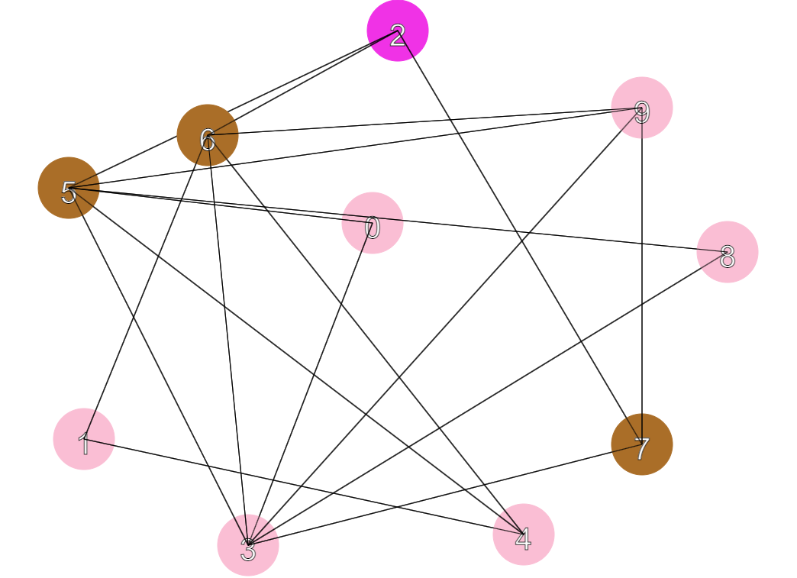
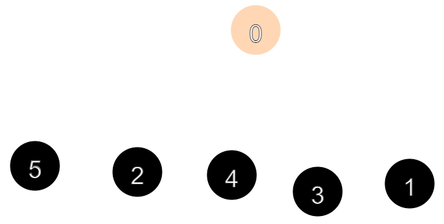
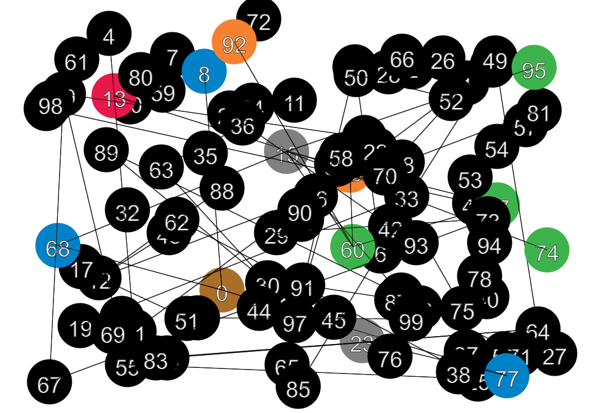
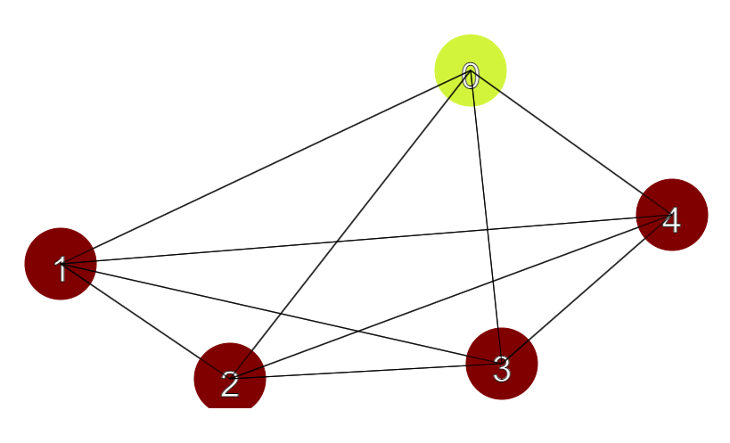

# <center> Sprawozdanie

## <center> Matematyka Dyskretna

### Autorzy

- Igor Gawłowicz
- Piotr Rucki
- Krystian Niedźwiedź

### Prezentowany program

- [Aplikacja](https://graphapp.herokuapp.com)
- [github](https://github.com/Zciwolvo/GraphApp)

# SPIS TREŚCI

- [SPIS TREŚCI](#spis-treści)
- [CZĘŚĆ TECHNICZNA](#część-techniczna)
  - [WSTĘP](#wstęp)
  - [Flask](#flask)
  - [Generowanie wierzchołków i działanie algorytmu](#generowanie-wierzchołków-i-działanie-algorytmu)
  - [JavaScript](#javascript)
- [CZĘŚĆ EMPIRYCZNA](#część-empiryczna)
  - [Test 1](#test-1)
  - [Test 2](#test-2)
  - [Test 3](#test-3)
  - [Test 4](#test-4)

<div style="page-break-after: always;"></div>

# CZĘŚĆ TECHNICZNA

## WSTĘP

Program został napisany w języku Python wraz z pomocą frameworka flask oraz biblioteki Flask-SocketIO do obsługi zdarzeń występujących w czasie rzeczywistym. Oprawa wizualna została napisana przy użyciu języka JavaScript oraz HTML.

## Flask

W funkcji ”**generateCircles**” przesyłane są dane wejściowe do serwera,

```Python
@app.route("/generate_circles", methods=["POST"])
def generate_circles():
    data = request.get_json()
    num_circles = data["numCircles"]
    connection_chance = data["connectionChance"]
    start_point = data["startPoint"]
    matrix = generate_matrix(num_circles, connection_chance / 100)
    circle_data = create_graph(matrix)
    layers = bfs(matrix, start_point)
    degrees_sum = 0
    degrees: list[int] = []
    for i in range(num_circles):
        degrees_sum += circle_data[i].degrees
        degrees.append(circle_data[i].degrees)
        x = circle_data[i].x
        y = circle_data[i].y
        radius = 40
        connections = circle_data[i].neighbours
        circle_data[i] = {
            "x": x,
            "y": y,
            "radius": radius,
            "connections": connections,
            "matrix": matrix,
        }
    density = (0.5 * degrees_sum) / (0.5 * len(matrix) * (len(matrix) - 1))
    circle_data[len(circle_data)] = layers
    circle_data[0]["density"] = density
    circle_data[0]["degrees"] = sorted(degrees, reverse=True)
    return jsonify(circle_data)
```

## Generowanie wierzchołków i działanie algorytmu

gdzie następuje ich przetwarzanie, w ciągu którego tworzymy macierz za pomocą funkcji **generate_matrix(n: int, p: float) -> list[int]**, która przyjmuje liczbę całkowitą jako ilość wierzchołków oraz liczbę zmiennoprzecinkową jako szansę na połączenie pomiędzy dwoma wierzchołkami po czym zwraca listę elementów typu całkowitego.

```Python
def generate_matrix(n: int, p: float) -> list[int]:
    """Generates [n]x[n] matrix with [p] chance of its elements being 1 and (1-[p]) chance of it being 0

    Returns:
        list[int]: Matrix describing graph
    """
    A = []
    p = p * 100
    for i in range(n):
        row = []
        for j in range(n):
            if i == j:
                row.append(0)
            elif j > i:
                r = randint(1, 100)
                if r <= p:
                    row.append(1)
                else:
                    row.append(0)
            else:
                row.append(A[j][i])
        A.append(row)
    return A
```

Następnie na podstawie otrzymanej macierzy jest tworzony graf w funckji **create_graph(matrix: list[int]) -> dict[int:Vertex]**, która przyjmuje listę elementów typu liczb całkowitych i zwraca słownik którego każdy element ma kluczem zawierający liczbę całkowitą odpowiadającą indexowi naszego wierzchołka i element typu **Vertex** jako jego wartość.

```Python
def create_graph(matrix: list[int]) -> dict[int:Vertex]:
    """Creates list of vertices and based on given argument [matrix] assigns it's neighbours indexes"""
    Graph: dict[int:Vertex] = {}
    for v in range(len(matrix)):
        vertex: Vertex = Vertex(v)
        vertex.get_neighbours(matrix)
        Graph[v] = vertex
    return Graph
```

Następnie nasz słownik jest przetwarzany przez funkcje **def bfs(A: list[list[int]], start: int) -> list[list[int]]**, która ponownie przyjmuje naszą macierz, oraz punkt startowy typu liczby całkowitej i zwraca nam listę składającą się z list zawierających liczby całkowite. Funkcja ta stosuje algorytm **Breadth First Search** czyli szukanie po szerokości. Algorytm jest zmodyfikowany w taki sposób aby zwracane wartości były posortowane na kolejne warstwy w wykresie zaczynając od punktu startowego.

```Python
def bfs(A: list[list[int]], start: int) -> list[list[int]]:
    """Breadth first search algorith generating layers of graph from matrix starting from integer start

    Args:
        A (list[list[int]]): matrix describing graph
        start (int): starting point

    Returns:
        list[list[int]]: list of lists describing each layer of graph
    """
    n = len(A)
    visited = [False] * n
    queue = deque([start])
    visited[start] = True
    layers = [[start]]
    while queue:
        layer = []
        for _ in range(len(queue)):
            vertex = queue.popleft()
            for neighbour in range(n):
                if A[vertex][neighbour] and not visited[neighbour]:
                    visited[neighbour] = True
                    queue.append(neighbour)
                    layer.append(neighbour)
        if layer:
            layers.append(layer)
    return layers
```

Ostatecznie wyliczana jest także ilość wierchołków suma stopni tych wierchołków oraz posortowana lista tych wierchołków. Dla wizualizacji jest także generowana losowa pozycja na osi x,y dla każdego wierchołka. Wyniki są zwracane jako JSON.

Funkcja ”**generateCirclesFromArray**” działa podobnie, ale przyjmuje macierz grafu jako argument wejściowy.

Funkcja ”**Update circles**”

```Python
@app.route("/update_circles", methods=["POST"])
def update_circles():
    data = request.get_json()
    start_point = data["startPoint"]
    matrix = data["matrix"]
    layers = bfs(matrix, start_point)
    return jsonify(layers)
```

aktualizuje naszą wizualizację po zmianie punktu startowego.

<div style="page-break-after: always;"></div>

## JavaScript

W JavaScriptie nasze dane są przyjmowane i na podstawie nich na ekranie wyświetlają się odpowiednie ”**kółka**” reprezentujące wierzchołki

```JS
function generateCircles(numCircles, connectionChance, startPoint) {
  console.log("Generating circles...");
  var xhr = new XMLHttpRequest();
  xhr.open("POST", "/generate_circles");
  xhr.setRequestHeader("Content-Type", "application/json;charset=UTF-8");
  xhr.send(
    JSON.stringify({
      numCircles: numCircles,
      connectionChance: connectionChance,
      startPoint: startPoint,
    })
  );
  xhr.onreadystatechange = function () {
    if (xhr.readyState === 4 && xhr.status === 200) {
      var circleData = JSON.parse(xhr.responseText);
      circles = addCircles(circleData);
      layers = circleData[Object.keys(circleData).length - 1];
      colors = generateColors(layers);
      matrix = circleData[0].matrix;
      density = circleData[0].density;
      degrees = circleData[0].degrees;
      displayData();
    }
  };
}
```

Podczas generowania całości musimy wykorzystać funkcję **addCircles(circleData)** która przyjmuje dane wysłane z servera i na ich podstawie generuje odpowiednią ilość wierchołków.

```JS
function addCircles(circleData) {
  var circles = [];
  var keys = Object.keys(circleData);
  for (var i = 0; i < keys.length - 1; i++) {
    var key = keys[i];
    var circle = {
      x: circleData[key].x,
      y: circleData[key].y,
      radius: circleData[key].radius,
      connections: circleData[key].connections,
    };
    circles.push(circle);
  }return circles;
}
```

Następuje także losowanie kolorów przypisanych dla każdej z warstw.

```JS
function generateColors(layers) {
  var colors = [];
  for (var i = 0; i < layers.length; i++) {
    var color = getRandomColor();
    if (colors.length < 20) {
      while (colors.indexOf(color) !== -1) {
        color = getRandomColor();
      }
    }
    colors.push(color);
  }
  return colors;
}
```

Gdy wszystkie dane są przygotowane musimy stworzyć jeszcze funkcje nasłuchujące, w naszym płótnie, odpowiednie wydarzenia

W poniższej funckji program sprawdza, który wierzchołek został przycisnięty na podstawie lokalizacji kursora na ekranie.

```JS
var isDragging = false;
var selectedCircle = null;

canvas.addEventListener("mousedown", function (event) {
  var rect = canvas.getBoundingClientRect();
  var mouseX = event.clientX - rect.left;
  var mouseY = event.clientY - rect.top;
  for (var i = 0; i < circles.length; i++) {
    var circle = circles[i];
    var distance = Math.sqrt(
      (mouseX - circle.x) ** 2 + (mouseY - circle.y) ** 2
    );
    if (distance <= circle.radius) {
      isDragging = true;
      selectedCircle = circle;
      break;
    }
  }
});
```

<div style="page-break-after: always;"></div>

W tej funkcji wyliczane są nowe współrzędne naszego wierzchołka w zależności od ruchu myszką.

```JS
canvas.addEventListener("mousemove", function (event) {
  if (isDragging && selectedCircle) {
    var rect = canvas.getBoundingClientRect();
    selectedCircle.x = event.clientX - rect.left;
    selectedCircle.y = event.clientY - rect.top;
  }
});
```

Ta funkcja blokuje pozostałe funkcje, które zależą od ruchu myszki.

```JS
canvas.addEventListener("mouseup", function (event) {
  isDragging = false;
  selectedCircle = null;
});
```

Ostatecznie trzeba wszystko podsumować w interwałach w których sprawdzane jest czy wszystko na naszym wirtualnym płótnie jest tak jak być powinno.

```JS
setInterval(function () {
  ctx.clearRect(0, 0, canvas.width, canvas.height);
  for (var i = 0; i < circles.length; i++) {
    var layer = -1;
    for (var j = 0; j < layers.length; j++) {
      if (layers[j].indexOf(i) !== -1) {
        layer = j;
        break;
      }
    }
    addCircle(circles[i], i, layer);
  }
  socket.emit("move", { x: x, y: y });
}, 10);
```

<div style="page-break-after: always;"></div>

# CZĘŚĆ EMPIRYCZNA

## Test 1

Liczba wierzchołków: 10  
Szansa na połązenie: 40%  
Punkt startowy: 2  
Macierz:

```python
[
 [0,0,0,0,0,1,0,0,0,0],
 [0,0,1,1,0,0,1,0,0,1],
 [0,1,0,1,0,0,1,0,0,1],
 [0,1,1,0,1,1,1,1,0,0],
 [0,0,0,1,0,0,0,0,1,1],
 [1,0,0,1,0,0,0,0,0,1],
 [0,1,1,1,0,0,0,1,1,0],
 [0,0,0,1,0,0,1,0,0,0],
 [0,0,0,0,1,0,1,0,0,1],
 [0,1,1,0,1,1,0,0,1,0]
]
```



Można zauważyć, że dla liczby wierzchołków niezbyt dużej, a jednocześnie niezbyt małej, szansa na połączenie, pomimo wynoszącej 40%, sprawia wrażenie lekkiego chaosu grafie. Wynika to z faktu, że dla 10 wierzchołków szansa na połączenie wynosi:

**1 - (1-0.4)^9 ~= 0.98**

Około 98% szansy na uzyskanie jakiegokolwiek połączenia dla każdego z wierzchołków.

Można także zauważyć, że gęstość dla przedstawionego grafu wynosi dokładnie 0.4, co jest całkiem spodziewanym wynikiem, biorąc pod uwagę szansę na połączenie. Dowodzi to, że gęstość jest wyliczana poprawnie, gdyż dla tych samych danych wejściowych gstość zazwyczaj waha się w przedziale <0.3, 0.5>. Skoro szansa na połączenie wynosi 40%, to statystycznie mamy spore szanse na uzyskanie wyniku gęstości przybliżonego wartości równej szansie na połączenie.

W ramach eksperymentu wyliczyłem średnią z 10 wyników przy tych samych danych wejściowych i otrzymałem następuce wyniki:

```
0.4, 0.48, 0.44, 0.57, 0.35, 0.37, 0.57, 0.37, 0.33, .37
```

Średnia tych wyników wynosi 0.425, co daje nam wynik dość mocno zbliżony do naszej szansy na połączenie równej 40%. Im więcej testów przeprowadzimy, tym bliżej liczby 0.4 powinna być nasza gęstość.

Można także zauważyć, że nasz po przepuszczeniu przez algorytm **BFS** zawiera łącznie 3 warstwy, zaczynając od naszego punktu startowego w wierzchołku o indeksie 2.

<div style="page-break-after: always;"></div>

## Test 2

Ilość wierzchołków: 6  
Szansa na połączenie: 0%  
Punkt startowy: 0  
Matrix:

```python
[
  [0,0,0,0,0,0],
  [0,0,0,0,0,0],
  [0,0,0,0,0,0],
  [0,0,0,0,0,0],
  [0,0,0,0,0,0],
  [0,0,0,0,0,0]
]
```



Tym razem sprawdzamy działanie naszego programu pod względem ekstremalnej sytuacji przy dowolnej liczbie wierzchołków i zerowej szansie na połączenie. Ignorując fakt, że szanse są z góry równe zeru, możemy podstawić nasze dane pod wzór na prawdopodobieństwo wystąpienia połączenia:

**1 - (1-0)^5 = 0**

Wynik zawsze daje nam 0. Co ciekawe, jednak przy ustawieniu pozornie bardzo niskiej szansy na połączenie, jaką byłaby 1%, nawet przy małej ilości wierzchołków, szansa na otrzymanie jakiegokolwiek połączenia wynosi aż 5%.

Ze względu na brak jakichkolwiek połączeń, mamy tylko jedną warstwę zawierającą jedynie punkt startowy.

<div style="page-break-after: always;"></div>

## Test 3

Ilość wierzchołków: 100  
Szansa na połączenie: 1%  
Punkt startowy: 0

Następny test jest pewnego rodzaju kolejnym ekstremum. Tym razem sprawdzamy coś, do czego odniosłem się w poprzednim teście, czyli bardzo niską szansę na połąc przy dużej ilości wierzchołków.

Od razu możemy zauważyć, że ścieżka przedstawiająca kolejne warstwy jest dość długa jak na to, że szansałączenia to tylko 1%. Jednak podstawiając pod wzór, możemy się łatwo przekonać, że ze względu na dużą ilość wierzchoł szansa już nie jest tak niska, jak się wydaje.

**1 - (1-0.01)^99 ~= 0.63**

Sprawia to, że każdy wierzchołek ma aż 63% szansy na posiadanie jakiegokolwiek połączenia. Widzimy jednak, patrząc na samą prezentację graficzną tego grafu, że graf wciąż ma wiele punktów “na krańcach” naszej ścieżki warstw algorytmu BFS.

Warto także dodać coś, co może nie być do końca oczywiste, lecz na grafie czarne “kółka” reprezentują wierzchołki, które nie mają połączenia z głą siecią.

<div style="page-break-after: always;"></div>

## Test 4

Liczba wierzchołków: 5  
Szansa na połączenie: 100%  
Punkt startowy: 0  
Matrix:

```python
[
 [0,1,1,1,1],
 [1,0,1,1,1],
 [1,1,0,1,1],
 [1,1,1,0,1],
 [1,1,1,1,0]
]
```



W tym przykzie pokazujemy działanie programu dla 100% szansy na połączenie. Łatwo możemy zauważyć, że w takiej sytuacji zawsze uzyskamy tylko dwie warstwy: warstwę wierzchołka startowego i warstwę drugą zawierającą wszystkie pozostałe elementy grafu.
